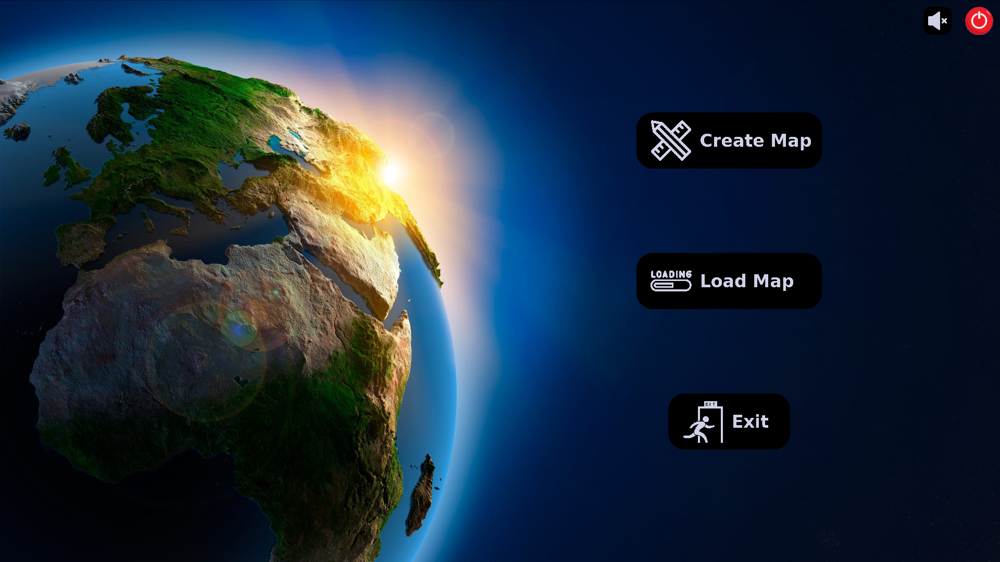
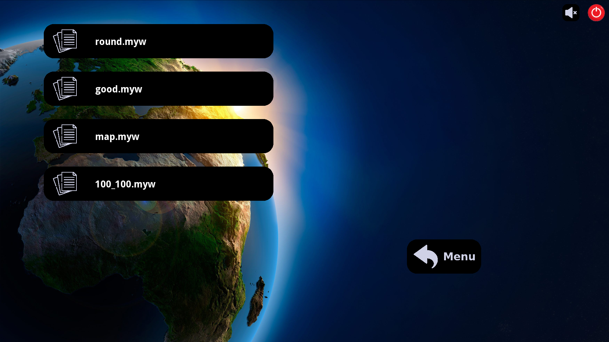
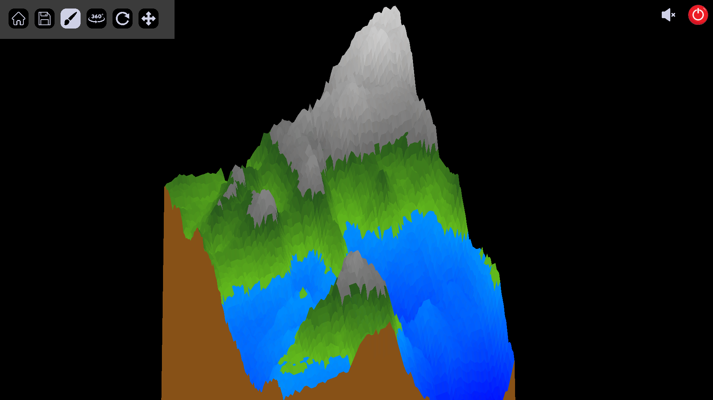

<h1 align="center">My world<br/>Epitech projet</h1>
<p>
</p>

A terraformer program which allows you to modify, save and load 3d maps.

### ✨ [Demo](miam)

## Install

```sh
git clone https://github.com/Mazettt/my_world.git ; cd my_world ; make
```

## Usage

```sh
./my_world
```

## Screenshots

<div>
    
    
    
    
</div>

## Author

👤 **Thomas Ott**

* Github: [@RedboardDev](https://github.com/RedboardDev)

👤 **Martin d'Hérouville**

* Github: [@Mazettt](https://github.com/Mazettt)
## Show your support

Give a ⭐️ if this project helped you!
